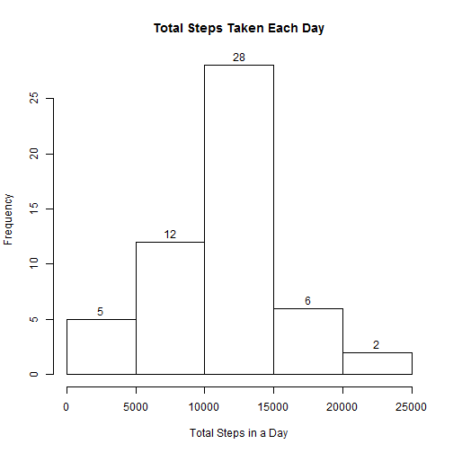
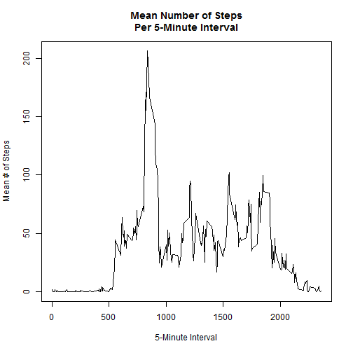
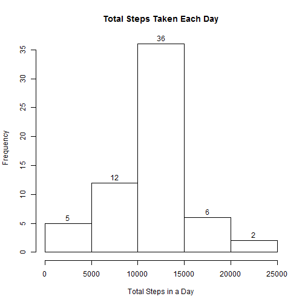
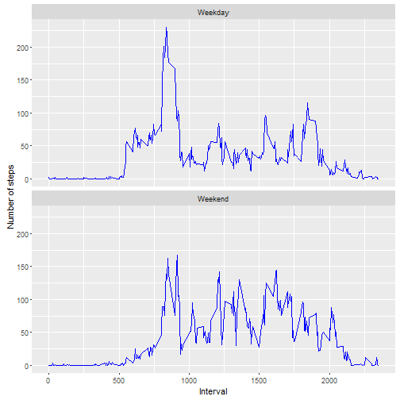

##Load and Process Data
Assumptions - your working directory contains activity.csv, and you have the tidyr and ggplot2 libraries installed.

```r
#load data and necessary libraries
activity <- read.csv(file="activity.csv", header=TRUE, na.strings = "NA")
library(ggplot2)
library(tidyr) #for gather()
```
##What is the mean total number of steps taken per day?
###Calculate the total number of steps taken per day

```r
#sums all the steps, per day, using tapply
tot_steps_date <- tapply(activity$steps, activity$date, sum)
print(tot_steps_date)
```

```
## 2012-10-01 2012-10-02 2012-10-03 2012-10-04 2012-10-05 2012-10-06 
##         NA        126      11352      12116      13294      15420 
## 2012-10-07 2012-10-08 2012-10-09 2012-10-10 2012-10-11 2012-10-12 
##      11015         NA      12811       9900      10304      17382 
## 2012-10-13 2012-10-14 2012-10-15 2012-10-16 2012-10-17 2012-10-18 
##      12426      15098      10139      15084      13452      10056 
## 2012-10-19 2012-10-20 2012-10-21 2012-10-22 2012-10-23 2012-10-24 
##      11829      10395       8821      13460       8918       8355 
## 2012-10-25 2012-10-26 2012-10-27 2012-10-28 2012-10-29 2012-10-30 
##       2492       6778      10119      11458       5018       9819 
## 2012-10-31 2012-11-01 2012-11-02 2012-11-03 2012-11-04 2012-11-05 
##      15414         NA      10600      10571         NA      10439 
## 2012-11-06 2012-11-07 2012-11-08 2012-11-09 2012-11-10 2012-11-11 
##       8334      12883       3219         NA         NA      12608 
## 2012-11-12 2012-11-13 2012-11-14 2012-11-15 2012-11-16 2012-11-17 
##      10765       7336         NA         41       5441      14339 
## 2012-11-18 2012-11-19 2012-11-20 2012-11-21 2012-11-22 2012-11-23 
##      15110       8841       4472      12787      20427      21194 
## 2012-11-24 2012-11-25 2012-11-26 2012-11-27 2012-11-28 2012-11-29 
##      14478      11834      11162      13646      10183       7047 
## 2012-11-30 
##         NA
```
###make a histogram of the total number of steps taken each day

```r
hist(tot_steps_date, labels=TRUE, main="Total Steps Taken Each Day", xlab ="Total Steps in a Day")
```



### Calculate and report the mean and median of the total number of steps taken per day.

```r
print(mean(tot_steps_date, na.rm=T))
```

```
## [1] 10766.19
```

```r
print (median(tot_steps_date, na.rm=T))
```

```
## [1] 10765
```

##What is the average daily activity pattern
###Make a time series plot of the 5-minute interval and average number of steps taken, averaged across all days

```r
int_avg <- tapply(activity$steps, activity$interval, mean, na.rm=T)
plot(unique(activity$interval), int_avg, type="l", xlab="5-Minute Interval", ylab="Mean # of Steps", 
     main="Mean Number of Steps\nPer 5-Minute Interval")
```



###Which 5-minute interval, on average across all the days in the dataset, contains the maximum number of steps?

```r
names(which.max(int_avg))
```

```
## [1] "835"
```

##Imputing missing values
###Calculate and report the total number of missing values in the dataset (i.e. the total number of rows with NAs)

```r
sum(is.na(activity$steps))
```

```
## [1] 2304
```
###Devise a strategy for filling in all of the missing values in the dataset
The new strategy will be to replace NA values with the mean of that 5-minute interval
###Create a new dataset that is equal to the original dataset but with the missing data filled in.

```r
# the code will create a copy of our dataframe, then determine which rows have NA values for steps
# for each of those rows, we'll then find the appropriate mean value for it's interval and fill in that value
activity_no_na <- activity
indx <- which(is.na(activity_no_na$steps))
for (i in indx) { 
    activity_no_na[i,1] <-  int_avg[which(names(int_avg) == activity_no_na[i,3])]
}
```

###Make a histogram of the total number of steps taken each day

```r
tot_steps_date_no_na <- tapply(activity_no_na$steps, activity_no_na$date, sum)
hist(tot_steps_date_no_na, labels = TRUE, main="Total Steps Taken Each Day", xlab ="Total Steps in a Day")
```



###Calculate and report the mean and median of the total number of steps taken per day.

```r
print(mean(tot_steps_date_no_na, na.rm=T))
```

```
## [1] 10766.19
```

```r
print (median(tot_steps_date_no_na, na.rm=T))
```

```
## [1] 10766.19
```

###Do these values differ from the estimates from the first part of the assignment
The mean has stayed the same, but the median has risen slightly to equal the mean
On the histogram, there are more dates with step totals between 10,000 and 15,000 steps,
but none of the other bins has been affected.

##Are there differences in activity patterns between weekdays and weekends

###Create a new factor variable in the dataset with two levels - "weekday" and "weekend" indicating whether a given date is a weekday or weekend day.


```r
isweekend <- function(x) {
  if (weekdays(as.Date(x)) %in% c("Monday", "Tuesday", "Wednesday", "Thursday", "Friday")) {return ("Weekday")}
  else {return("Weekend")}
}
activity_no_na$date_type <- as.factor (apply(activity_no_na, 1, function(x) isweekend(x[2])))
```

###Make a panel plot containing a time series plot (i.e. type = "l") of the 5-minute interval (x-axis) and the average number of steps taken, averaged across all weekday days or weekend days (y-axis)


```r
means <- with(activity_no_na,tapply( steps, list(interval,date_type), mean))
means_df <- data.frame(key=as.numeric(rownames(means)), means)
newmeans_df <- gather(means_df, "date_type", "mean", 2:3 )
newmeans_df$key <- as.numeric(newmeans_df$key)
newmeans_df$date_type <- as.factor(newmeans_df$date_type)

g <- ggplot(newmeans_df, aes(key, mean))
g + geom_line(col="blue") + facet_wrap(~date_type,ncol=1) + labs(y="Number of steps", x="Interval")
```


